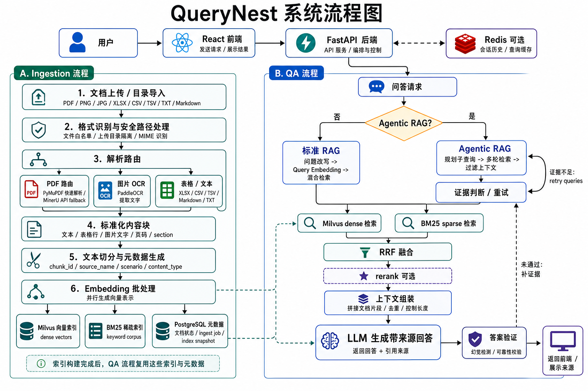

# QueryNest

QueryNest 是一个本地可运行的知识库问答应用。项目提供 FastAPI 后端、React/Vite 前端，并使用 PostgreSQL、Milvus、Redis 等服务支撑文档索引、混合检索、多轮对话、Agentic RAG 和缓存。

## 主要功能

- 上传本地文件或指定目录，解析并构建知识库索引。
- 支持多类知识源解析：PDF、PNG/JPG/JPEG 图片、XLSX 表格、CSV/TSV 数据表、TXT/Markdown 文本。
- PDF 使用混合解析策略：优先走 PyMuPDF 快速文本抽取，遇到扫描件、复杂版式、低质量文本或表格公式场景时可切换或回退到 MinerU API。
- 图片使用 PaddleOCR 抽取文字，并保留图片来源、文件类型和内容类型元数据。
- XLSX、CSV、TSV 会转换为结构化文本块，便于后续切分、检索和引用。
- 使用 Milvus dense 检索、BM25 sparse 检索、RRF 融合和可选 rerank。
- 支持 Agentic RAG 模式：自动规划子查询、迭代检索、过滤上下文、验证答案并在证据不足时重试。
- 提供多轮对话、场景筛选、文档列表、chunk 浏览和模型状态查看。
- 支持 Redis 会话历史和检索缓存，PostgreSQL 存储知识库元数据。

## 技术栈

- 后端：Python 3.12、FastAPI、LangChain、LangGraph、Pydantic Settings
- 检索与存储：Milvus、PostgreSQL、Redis、BM25、RRF
- 文档处理：PyMuPDF、PaddleOCR、MinerU API
- 前端：React 19、TypeScript、Vite、lucide-react
- 基础设施：Docker Compose

## 工作流程



## 项目结构

```text
.
├── backend/
│   ├── app/                 # FastAPI 应用、RAG 服务、索引、解析器和配置
│   ├── app/migrations/      # PostgreSQL 元数据迁移
│   ├── scripts/             # 运维和迁移脚本
│   └── pyproject.toml       # 后端依赖声明
├── frontend/
│   ├── src/                 # React 前端源码
│   ├── package.json         # 前端依赖和脚本
│   └── vite.config.ts       # Vite 配置
├── compose.yaml             # Milvus、Redis、PostgreSQL 等本地服务
├── .env.example             # 环境变量示例，不包含真实密钥
└── README.md
```

## 安装依赖

```powershell
python -m venv .venv
.\.venv\Scripts\python -m pip install -e .\backend

cd frontend
npm install
```

可选：安装完成后运行一次构建校验，确认前端 TypeScript 和生产构建正常：

```powershell
cd frontend
npm run build
```

后端如需按普通 Python 包安装，而不是开发模式安装，可以使用：

```powershell
.\.venv\Scripts\python -m pip install .\backend
```

## 环境变量

复制示例文件并填写本地密钥：

```powershell
Copy-Item .env.example .env
```

默认使用 OpenAI-compatible 风格的模型配置。最少需要填写聊天模型和向量模型的 provider、model 和 API key：

```env
LLM_PROVIDER=zhipu
LLM_MODEL=glm-5.2
LLM_API_KEY=replace-with-your-chat-api-key

EMBEDDING_PROVIDER=zhipu
EMBEDDING_MODEL=embedding-3
EMBEDDING_API_KEY=replace-with-your-embedding-api-key
```

可选 provider：

- `LLM_PROVIDER`：`zhipu`、`bailian`、`openai`、`deepseek`
- `EMBEDDING_PROVIDER`：`zhipu`、`bailian`、`openai`，DeepSeek 不提供 embedding 配置

如果使用供应商兼容 key，也可以在 `LLM_API_KEY` 或 `EMBEDDING_API_KEY` 留空时填写：

```env
ZAI_API_KEY=replace-with-your-zhipu-key
DASHSCOPE_API_KEY=replace-with-your-dashscope-key
```

本地存储服务默认值已经写在代码和 `compose.yaml` 中。只要使用本项目的 Docker Compose 启动 `postgres`、`milvus` 和 `redis`，通常不需要在 `.env` 中写 `POSTGRES_DSN`、`MILVUS_URI`、`MILVUS_COLLECTION_NAME`、`KB_ID`、`ARTIFACT_DIR` 或 `SQLITE_PATH`。

常用变量：

| 变量 | 是否必填 | 说明 |
| --- | --- | --- |
| `LLM_PROVIDER` | 是 | 聊天模型提供商，可选 `zhipu`、`bailian`、`openai`、`deepseek`。 |
| `LLM_MODEL` | 是 | 聊天模型名称，例如 `glm-5.2`。 |
| `LLM_API_KEY` | 是 | 聊天模型 API key。留空时会尝试使用兼容 key，例如 `ZAI_API_KEY` 或 `DASHSCOPE_API_KEY`。 |
| `LLM_BASE_URL` | 否 | 自定义 OpenAI-compatible API 地址；留空时使用 provider 默认地址。 |
| `EMBEDDING_PROVIDER` | 是 | 向量模型提供商，可选 `zhipu`、`bailian`、`openai`；DeepSeek 不支持 embedding。 |
| `EMBEDDING_MODEL` | 是 | 向量模型名称，例如 `embedding-3`。 |
| `EMBEDDING_API_KEY` | 是 | 向量模型 API key。留空时会尝试使用兼容 key。 |
| `EMBEDDING_BASE_URL` | 否 | 自定义 embedding API 地址；留空时使用 provider 默认地址。 |
| `EMBEDDING_DIMENSIONS` | 否 | 自定义向量维度；留空时使用模型默认维度。 |
| `RERANK_PROVIDER` | 否 | 可选 rerank 提供商，可选 `bailian`、`zhipu`、`none`。 |
| `RERANK_MODEL` | 否 | rerank 模型名称。 |
| `RERANK_API_KEY` | 否 | rerank API key。 |
| `MINERU_API_TOKEN` | 否 | 使用 MinerU API 解析复杂 PDF 或开启 MinerU fallback 时需要。 |
| `ZAI_API_KEY` | 否 | 智谱兼容 key；当 `LLM_API_KEY` 或 `EMBEDDING_API_KEY` 留空且 provider 为 `zhipu` 时使用。 |
| `DASHSCOPE_API_KEY` | 否 | 百炼兼容 key；当 provider 为 `bailian` 且 role-specific key 留空时使用。 |
| `REDIS_URL` | 否 | 取消 `.env.example` 中的注释后启用 Redis 会话历史和检索缓存；不设置时使用 SQLite 会话历史，缓存关闭。 |
| `LANGSMITH_TRACING` | 否 | 可选观测开关，默认不启用。 |
| `LANGSMITH_API_KEY` / `LANGSMITH_PROJECT` | 否 | LangSmith 追踪配置。 |
| `VITE_API_BASE` | 否 | 前端访问后端 API 的地址，默认 `http://127.0.0.1:8000`。 |

不要提交真实 `.env` 文件或任何包含密钥的本地配置。

## 5 分钟使用体验

1. 启动本地依赖：

```powershell
docker compose up -d postgres milvus redis
```

2. 安装依赖并启动后端：

```powershell
python -m venv .venv
.\.venv\Scripts\python -m pip install -e .\backend
.\.venv\Scripts\python -m uvicorn app.main:app --app-dir backend --reload --host 127.0.0.1 --port 8000
```

3. 启动前端：

```powershell
cd frontend
npm install
npm run dev -- --host 127.0.0.1 --port 5173
```

4. 打开 `http://127.0.0.1:5173`，上传一个 PDF、图片、XLSX、CSV 或 Markdown 文件，等待索引完成。

5. 在聊天框提问。普通问题默认使用标准 RAG；需要更强的多跳检索或证据验证时，开启 Agentic RAG 后再提问。

## Agentic RAG

默认问答使用标准 RAG 链路：问题改写、混合检索、RRF/rerank 排序和回答生成。开启 Agentic RAG 后，后端会通过 LangGraph 执行更完整的检索决策流程，适合跨章节、多实体、多条件或需要证据自检的问题。

流程包括：

- 意图判断：判断问题是否需要检索；如果不需要，可以直接回答。
- 查询规划：把复杂问题拆成最多 3 个子查询，每个子查询包含问题和目的。
- 多查询检索：对规划出的子查询执行 Milvus dense + BM25 sparse 混合检索，并继续使用 RRF/rerank 排序。
- 上下文过滤：让模型判断哪些 chunk 与答案相关，丢弃明显无关的上下文。
- 证据判断：检查当前上下文是否足够回答问题。
- 自适应重试：证据不足时最多重试 2 轮，重试策略包括原查询复用、拓宽、收窄、实体扩展、关键词查询和问题重写。
- 答案验证：生成答案后再次检查回答是否被检索来源支持。
- 调试追踪：在 `retrieval_debug.agentic` 中返回计划、尝试过的查询、上下文过滤结果、证据判断和验证结果。

Agentic RAG 不替代标准 RAG。简单事实查询或单文档问答通常使用标准模式更快；复杂问题开启 Agentic RAG 会增加 LLM 调用次数和延迟，但能提升多跳问题的召回和证据检查能力。

## 项目边界

- 本项目是本地知识库 RAG 原型，不是开箱即用的多租户 SaaS 平台。
- 当前检索质量依赖文档解析质量、向量模型、BM25 分词、rerank 配置和知识库内容覆盖度。
- Agentic RAG 会做规划、重试和验证，但不能保证回答绝对正确；高风险场景仍需要人工复核来源。
- 当前支持的上传格式以代码白名单为准：`.pdf`、`.png`、`.jpg`、`.jpeg`、`.xlsx`、`.csv`、`.tsv`、`.txt`、`.md`。
- Docker Compose 配置面向本地开发，生产部署需要额外处理鉴权、HTTPS、持久化备份、监控和资源隔离。

## 常用接口

- `GET /api/health`
- `GET /api/scenarios`
- `GET /api/documents`
- `GET /api/chunks`
- `GET /api/models`
- `POST /api/warmup`
- `POST /api/ingest/path`
- `POST /api/ingest/files`
- `POST /api/chat`，请求体支持 `agentic: true` 开启 Agentic RAG
